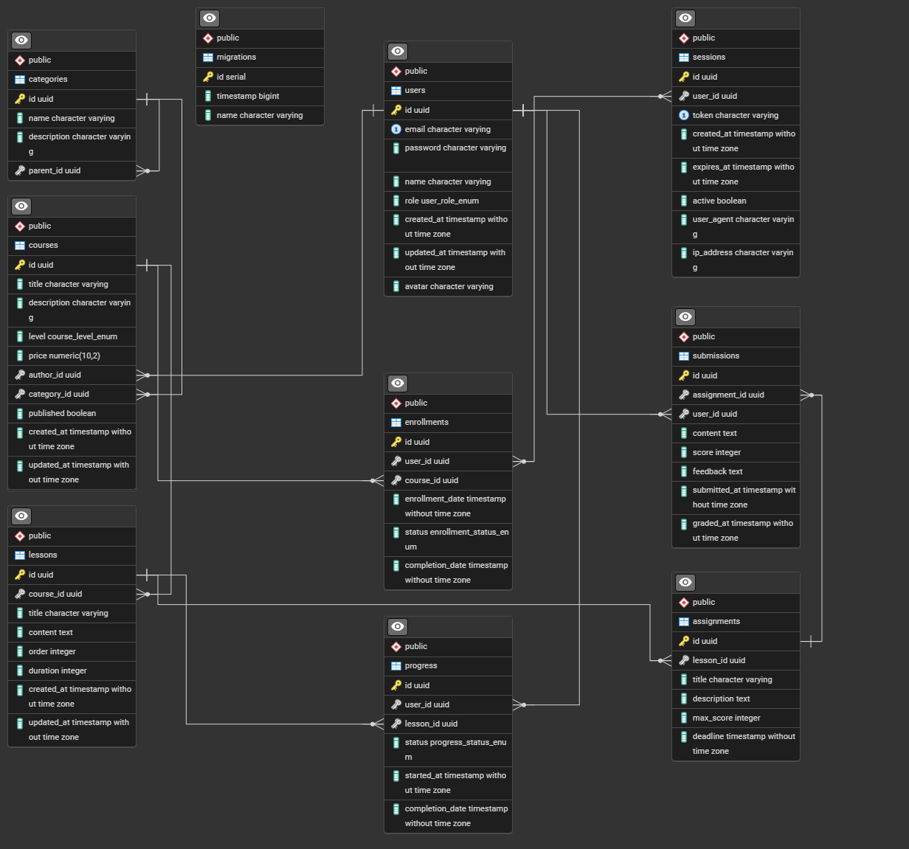

# WEB-Backend

## О проекте

Проект представляет собой веб-приложение для онлайн школы-курсов, разработанное с использованием NestJS.

## Автор

**ФИО:** Фомин Александр Игоревич
**Группа:** M3313

## Ссылка на развернутое приложение

[Ссылка на приложение на Render](https://web-backend-deploy.onrender.com/)

## Доменная модель

### Описание предметной области

Онлайн платформа для обучения, где пользователи могут проходить курсы различных категорий. Система поддерживает разные роли пользователей (студент, преподаватель, администратор), управление курсами и отслеживание прогресса обучения.

### Основные сущности

1. **User (Пользователь)** - пользователь системы с определенной ролью
   - id: уникальный идентификатор
   - email: электронная почта (логин)
   - password: хешированный пароль
   - name: имя пользователя
   - role: роль (студент, преподаватель, администратор)
   - created_at: дата регистрации
   - updated_at: дата обновления
   - avatars: аватар пользователя

2. **Course (Курс)** - учебный курс с набором уроков
   - id: уникальный идентификатор
   - title: название курса
   - description: описание курса
   - level: уровень сложности (начальный, средний, продвинутый)
   - price: стоимость
   - author_id: ID преподавателя (связь с User)
   - category_id: ID категории (связь с Category)
   - created_at: дата создания
   - updated_at: дата обновления
   - published: опубликован ли курс

3. **Lesson (Урок)** - урок в составе курса
   - id: уникальный идентификатор
   - course_id: ID курса (связь с Course)
   - title: название урока
   - content: содержание урока
   - order: порядковый номер урока в курсе
   - duration: продолжительность в минутах
   - created_at: дата создания
   - updated_at: дата обновления

4. **Category (Категория)** - категория для классификации курсов
   - id: уникальный идентификатор
   - name: название категории
   - description: описание категории
   - parent_id: ID родительской категории (для иерархии, может быть null)

5. **Enrollment (Запись на курс)** - связь между пользователем и курсом
   - id: уникальный идентификатор
   - user_id: ID пользователя (связь с User)
   - course_id: ID курса (связь с Course)
   - enrollment_date: дата записи на курс
   - status: статус (активный, завершенный, отмененный)
   - completion_date: дата завершения курса

6. **Assignment (Задание)** - задание, относящееся к уроку
   - id: уникальный идентификатор
   - lesson_id: ID урока (связь с Lesson)
   - title: название задания
   - description: описание задания
   - max_score: максимальный балл за задание
   - deadline: срок выполнения

7. **Submission (Решение)** - решение задания пользователем
   - id: уникальный идентификатор
   - assignment_id: ID задания (связь с Assignment)
   - user_id: ID пользователя (связь с User)
   - content: содержание решения
   - score: полученный балл
   - feedback: отзыв преподавателя
   - submitted_at: дата отправки
   - graded_at: дата проверки

8. **Progress (Прогресс)** - прогресс пользователя по уроку
   - id: уникальный идентификатор
   - user_id: ID пользователя (связь с User)
   - lesson_id: ID урока (связь с Lesson)
   - status: статус (не начат, в процессе, завершен)
   - last_viewed_at: дата последнего просмотра
   - completion_date: дата завершения

9.	**Sessions (Сессия)** – сессии авторизованных пользователей
     - id: уникальный идентификатор
     - user_id: ID пользователя (связь с User)
     - token: уникальный токен доступа
     - created_at: дата создания сессии
     - expires_at: дата истечения срока действия токена
     - active: статус сессии
     - user_agent: user-agents пользователя
     - ip_address: ip адресс пользователя


### ER-диаграмма



## Запуск проекта

```bash
# установка зависимостей
$ npm install

# запуск в режиме разработки
$ npm run start:dev

# сборка проекта
$ npm run build

# запуск в production режиме
$ npm run start:prod
```
